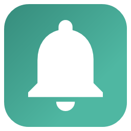
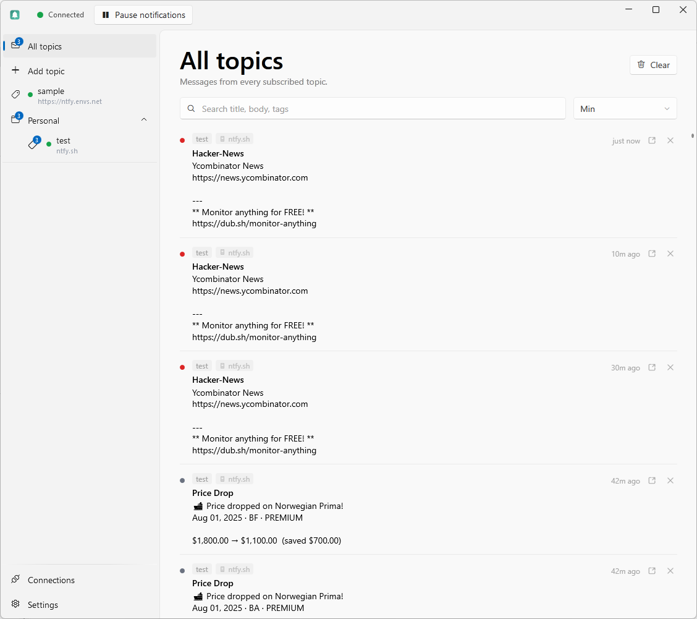
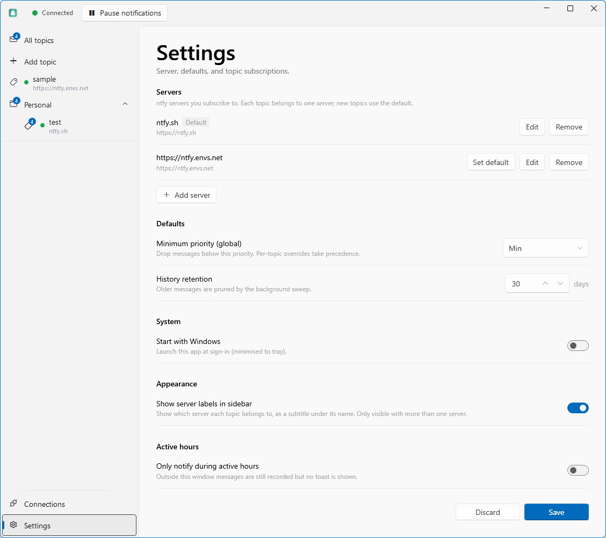
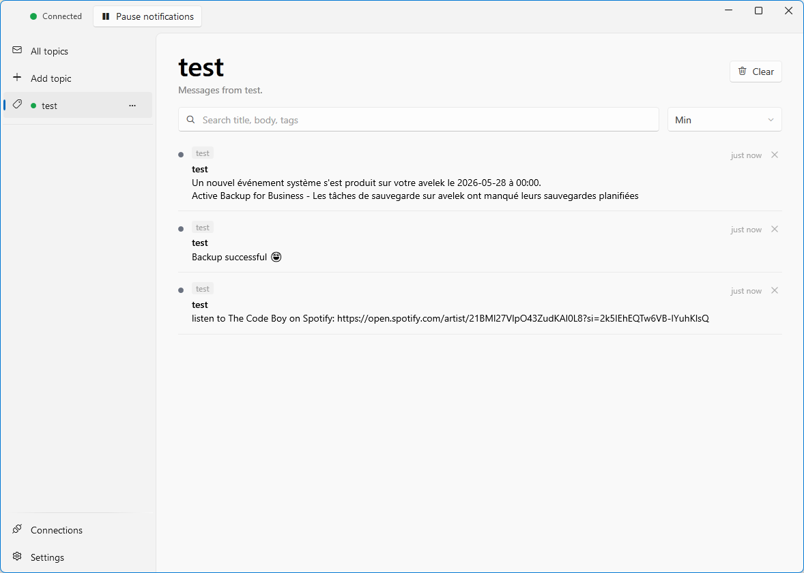
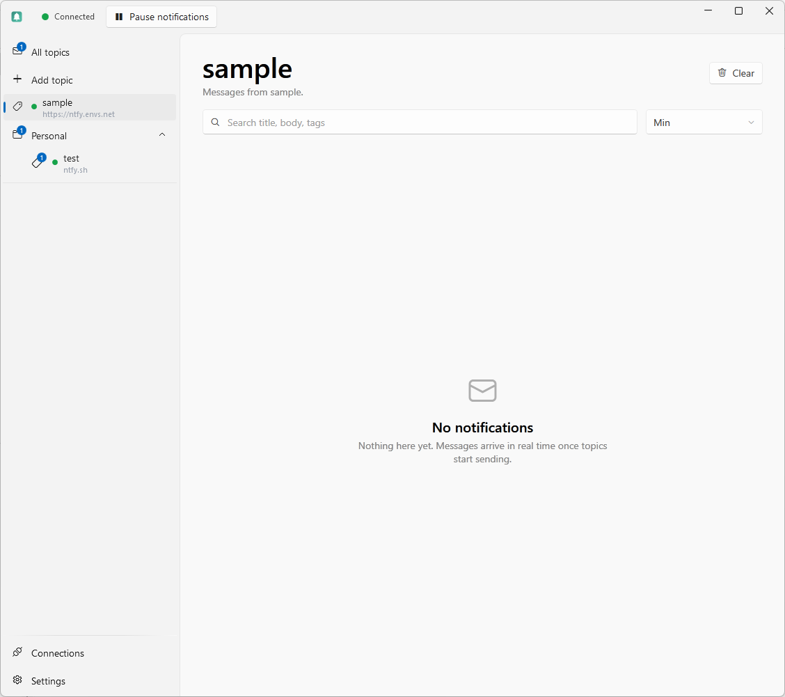
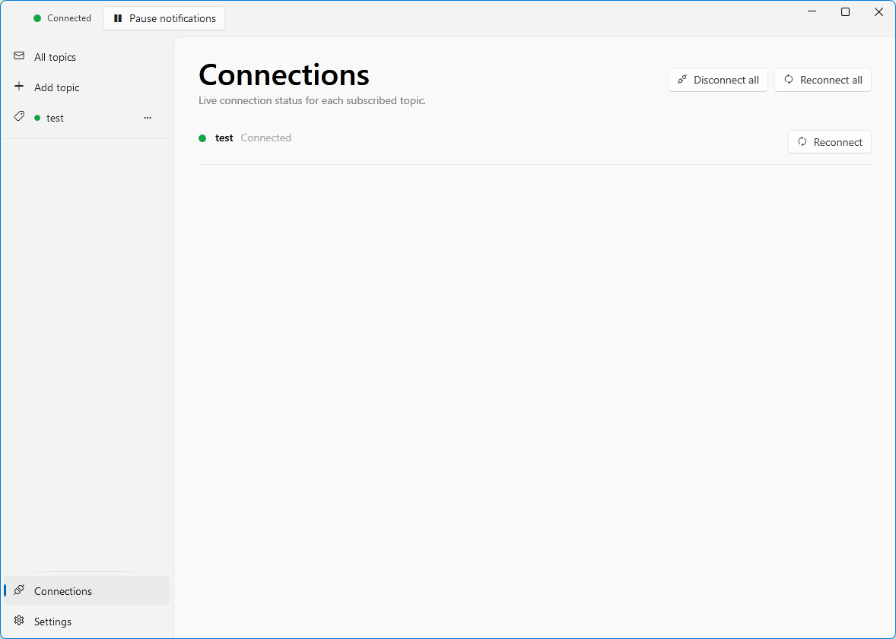
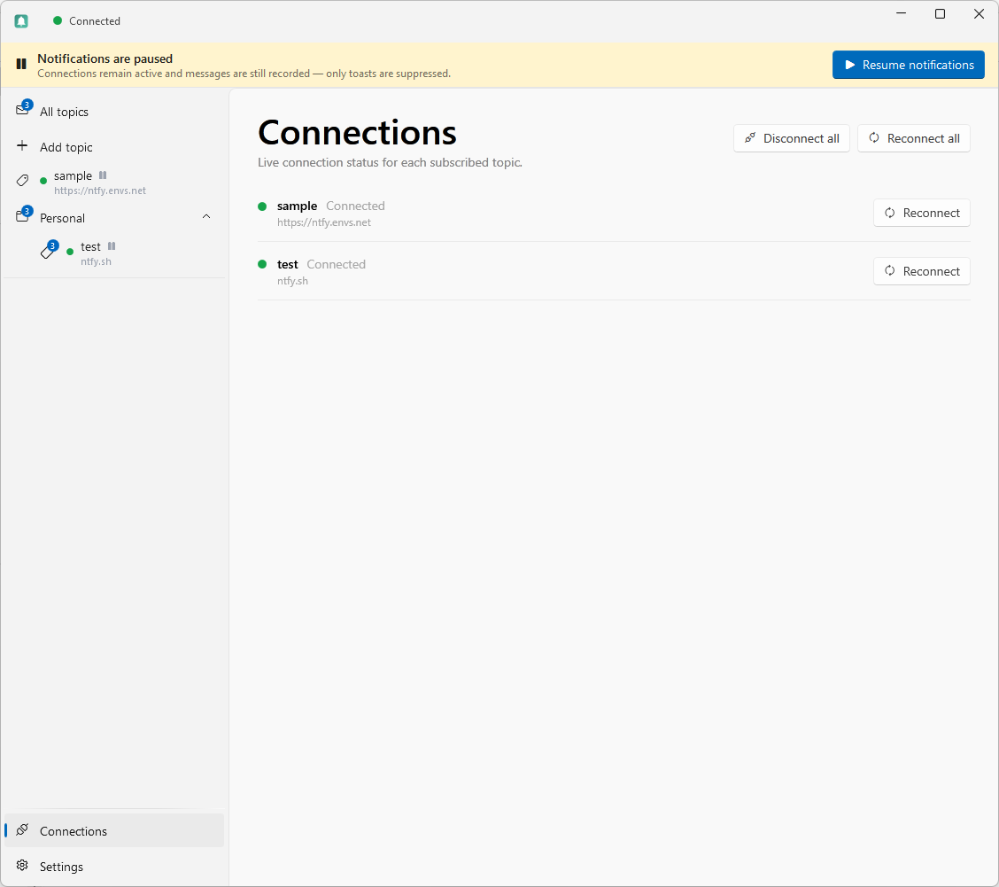
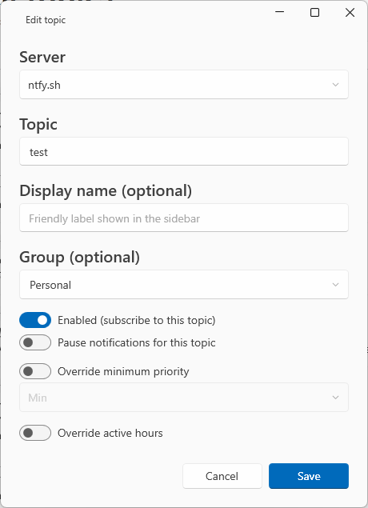

<p align="center">
  
</p>

<h1 align="center">ntfy Desktop</h1>

<p align="center">
  <a href="https://github.com/simoneferrari/ntfy-desktop/actions/workflows/build.yml">
    
  </a>
</p>

A Windows desktop client for [ntfy](https://ntfy.sh) — subscribe to topics across one or more servers, receive Windows toast notifications, and browse your message history from the system tray.

> **Status:** early pre-release (v0.x). Functional and in daily use, but the API surface and data formats may still change.

## Screenshots

<p align="center">
  
</p>

| | |
|---|---|
|  |  |
| *Settings, multiple servers, and the sidebar* | *Single-topic feed* |
|  |  |
| *Unread badges in the rail* | *Live connection status per topic* |
|  |  |
| *Global notification pause* | *Add or edit a topic* |

## Features

**Servers and topics**
- Subscribe to topics across multiple ntfy servers (for example a self-hosted instance alongside `ntfy.sh`)
- Per-topic server selection, with a dedicated server-management UI and a configurable default
- Add, edit, enable/disable, and remove topics directly from the navigation rail
- Organise topics into collapsible groups in the rail, with manual ordering and drag-and-drop
- Optional per-topic display names, with an optional server label under each topic (when more than one server is configured)

**Notifications**
- Windows toast notifications for every incoming message, with priority-based sound and urgency
- Click a toast to open its link, or to bring the app to the relevant topic when no link is set
- ntfy tags rendered as emoji, matching the ntfy web app
- Global and per-topic notification pause — connections stay live; only toasts are suppressed
- Active hours — suppress toasts outside a configurable time window

**Feed and history**
- In-app message feed with per-topic filtering, full-text search, and priority threshold
- Action buttons on messages, both in the feed and on toast notifications — open a link (`view`), copy a value (`copy`), or fire an `http` request after a confirmation prompt
- Unread-message badges on the rail (per topic and across all topics); opening a feed marks it read
- Message history persisted in SQLite, with configurable retention

**Security**
- Per-server access tokens encrypted at rest with Windows DPAPI
- Bearer tokens are never sent over plain `ws://` / `http://`

**Application**
- System tray with colour-coded connection status (green / amber / red); unread count shown in the tooltip
- Fluent design (WPF-UI) that follows the system light/dark theme
- Single-instance; runs in the background after the window is closed
- Optional custom data directory via `--data-path` (useful for portable use or multiple profiles)

## Roadmap

Planned, in rough order. Open an issue if you'd like to discuss priorities or propose alternatives.

**0.2 — Quick wins** (shipped in v0.2)
- [x] Click-through on toasts (open the message's `click` URL)
- [x] Open the app feed when a toast is clicked
- [x] Render ntfy tags as emoji

**0.3 — Multiple servers** (shipped in v0.3)
- [x] Subscribe to topics across more than one ntfy server (e.g. self-hosted + `ntfy.sh`)
- [x] Per-topic server selection
- [x] Server management UI
- [x] Per-topic display names (friendly labels)

**0.4 — Topic groups & tray unread count**
- [x] Topic groups/folders (collapsible groups in the nav rail, with manual ordering and drag-and-drop)
- [x] Unread count in the tray tooltip (unread total on the tray icon)

**0.5 — Catch up on missed messages** (shipped in v0.5)
- [x] Fetch messages that arrived while the app was closed or offline (ntfy `since=`), backfilling history and the feed on every (re)connect so nothing is missed across restarts — matching the ntfy web client
- [x] Summarise the catch-up in a single "N messages while you were away" notification instead of replaying a toast per missed message

**0.6 — Richer messages**
- [x] Action buttons (`view` / `http` / `copy`) in the feed and on toast notifications, with confirmation before firing an `http` request
- [x] Image attachments inline in the feed

**0.7 — Polish**
- [ ] Username/password authentication (in addition to access tokens)
- [ ] Markdown subset rendering in message bodies (bold, italic, links, code)
- [ ] "New version available" banner (checks GitHub Releases)
- [ ] Encrypt `history.db` at rest

**Later**
- [x] Unread/read state with per-topic and All-topics badges in the rail
- [ ] Multiplex topics per server onto a single WebSocket (like the official web client; fewer sockets, avoids per-visitor connection/subscription limits)
- [ ] Windows Focus Assist integration
- [ ] Test-publish dialog
- [ ] Settings import/export
- [ ] `ntfy://` URL scheme handler
- [ ] Localisation

## Requirements

| | |
|---|---|
| **OS** | Windows 10 1809 (build 17763) or later |
| **Runtime** | .NET 10 desktop runtime (bundled in published builds) |
| **Build** | .NET 10 SDK |

## Installation

Pre-built releases are published on the [Releases](../../releases) page as a single self-contained `.exe` — no installer required. Download, place anywhere, run.

### First run: Windows SmartScreen

The app is not yet code-signed, so the first time you run it Windows SmartScreen may show a *"Windows protected your PC"* dialog. This is expected for unsigned software that has not yet built up a download reputation — it does not indicate a problem with the application. To continue, click **More info**, then **Run anyway**.

If you prefer to verify the binary first, every release's notes include a [VirusTotal](https://www.virustotal.com/) scan link for that build; you can also upload the downloaded `.exe` to VirusTotal yourself. Code signing is on the roadmap, which will remove this prompt.

## Building from source

```bash
git clone https://github.com/simoneferrari/ntfy-desktop.git
cd ntfy-desktop
dotnet build NtfyDesktop.csproj
```

Or open `NtfyDesktop.csproj` directly in Visual Studio 2022 / JetBrains Rider.

To publish a self-contained single-file executable:

```bash
dotnet publish NtfyDesktop.csproj -c Release -r win-x64 --self-contained -p:PublishSingleFile=true -o publish/
```

## Usage

1. Launch the app — it appears in the system tray.
2. Double-click the tray icon (or click **Show**) to open the window.
3. Open **Settings → Servers**. A default `https://ntfy.sh` server is preconfigured; add or edit servers (and access tokens) as needed.
4. Click **Add topic** in the navigation rail, choose its server, and optionally give it a display name.
5. Messages arrive as Windows toasts and accumulate in the in-app feed.

Settings, history, and the encrypted access tokens are stored under `%AppData%\NtfyDesktop\` by default. Pass `--data-path <dir>` at launch to use a different location.

## Architecture

See [ARCHITECTURE.md](ARCHITECTURE.md) for a detailed description of the feature structure, key design decisions, and the connection/notification separation model.

## Contributing

Issues and pull requests are welcome. Please open an issue first for anything beyond a small bug fix.

## License

[MIT](LICENSE)
